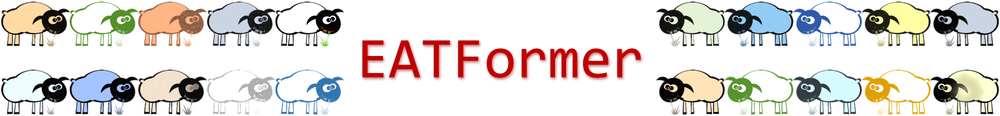
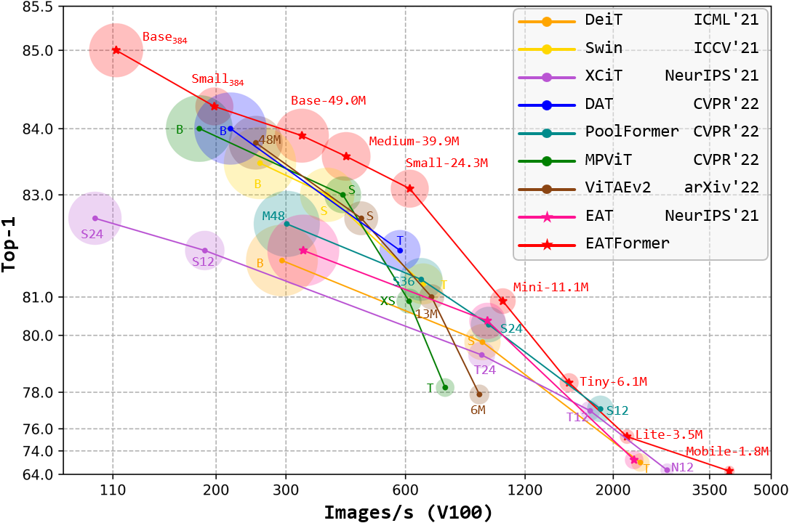
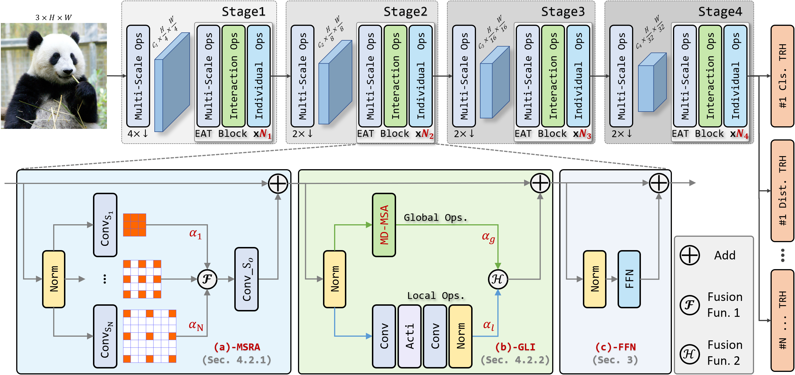

<div align="center">
    
    <div>&nbsp;</div>
    <div align="center">
        <a href="https://april.zju.edu.cn/">
        APRIL Lab
        </a>
        &nbsp;&nbsp;&nbsp;&nbsp;
        <a href="https://open.youtu.qq.com/#/open">
        Youtu Lab
        </a>
    </div>
</div>

--- 
Official [PyTorch](https://pytorch.org/) implementation of "[EATFormer: Improving Vision Transformer Inspired by
Evolutionary Algorithm](https://arxiv.org/abs/2206.09325)" that improves our previous work "[Analogous to Evolutionary Algorithm: Designing a Unified Sequence Model, NeurIPS'21](https://openreview.net/forum?id=yn267zYn8Eg)", [Code](https://github.com/TencentYoutuResearch/BaseArchitecture-EAT).

> **Abstract** *Motivated by biological evolution, this paper explains the rationality of Vision Transformer by analogy with the proven practical Evolutionary Algorithm (EA) and derives that both have consistent mathematical formulation. Then inspired by effective EA variants, we propose a novel pyramid EATFormer backbone that only contains the proposed EA-based Transformer (EAT) block, which consists of three residual parts, \ie, Multi-Scale Region Aggregation (MSRA), Global and Local Interaction (GLI), and Feed-Forward Network (FFN) modules, to model multi-scale, interactive, and individual information separately. Moreover, we design a Task-Related Head (TRH) docked with transformer backbone to complete final information fusion more flexibly and improve a Modulated Deformable MSA (MD-MSA) to dynamically model irregular locations. Massive quantitative and quantitative experiments on image classification, downstream tasks, and explanatory experiments demonstrate the effectiveness and superiority of our approach over State-Of-The-Art (SOTA) methods. \Eg, our Mobile (1.8M), Tiny (6.1M), Small (24.3M), and Base (49.0M) models achieve 69.4, 78.4, 83.1, and 83.9 Top-1 only trained on ImageNet-1K with naive training recipe; EATFormer-Tiny/Small/Base armed Mask-R-CNN obtain 45.4/47.4/49.0 box AP and 41.4/42.9/44.2 mask AP on COCO detection, surpassing contemporary MPViT-T, Swin-T, and Swin-S by 0.6/1.4/0.5 box AP and 0.4/1.3/0.9 mask AP separately with less FLOPs; Our EATFormer-Small/Base achieve 47.3/49.3 mIoU on ADE20K by Upernet that exceeds Swin-T/S by 2.8/1.7.*

<div align="center">
  
</div>

<div align="center">
  
</div>

# Main results
## Image Classification for [ImageNet-1K](https://www.image-net.org):
| Model & Url | Params. <br>(M) | FLOPs <br>(G) | Throughput <br>(V100 GPU) | Throughput <br>(Xeon 8255C @ 2.50GHz CPU) | Image Size | Top-1 |
| --- | :---: | :---: | :---: | :---: | :---: | :---: |
| [EATFormer-Mobile](https://drive.google.com/file/d/1CimNN0rH77F3UtQeMLN3sB2ls_JfRWRH/view?usp=sharing) | 1.8 | 0.36 | 3926 | 456.3 | 224 x 224 | 69.4 |
| [EATFormer-Lite](https://drive.google.com/file/d/1GEgdCWKSlHNFKKBCoDErIm8ylAf6vf3S/view?usp=sharing) | 3.5 | 0.91 | 2168 | 246.3 | 224 x 224 | 75.4 |
| [EATFormer-Tiny](https://drive.google.com/file/d/1di6ZsPK4cmelTuwmclJZpEbsBuK181fN/view?usp=sharing) | 6.1 | 1.41 | 1549 | 167.5 | 224 x 224 | 78.4 |
| [EATFormer-Mini](https://drive.google.com/file/d/10lzNUQynS5ilOKUr7VFDTUM0na4x6IRo/view?usp=sharing) | 11.1 | 2.29 | 1055 | 122.1 | 224 x 224 | 80.9 |
| [EATFormer-Small](https://drive.google.com/file/d/16DY0LtPY09hn8uB7xAIwyGUyKF8CsRHp/view?usp=sharing) | 24.3 | 4.32 | 615 | 73.3 | 224 x 224 | 83.1 |
| [EATFormer-Medium](https://drive.google.com/file/d/1iopLMPn2BZOF2vDrQ1v18CwX1VeWZOXr/view?usp=sharing) | 39.9 | 7.05 | 425 | 53.4 | 224 x 224 | 83.6 |
| [EATFormer-Base](https://drive.google.com/file/d/1E6Gbt5ZhdfrEZklxXWob_RxWoXvicbE-/view?usp=sharing) | 49.0 | 8.94 | 329 | 43.7 | 224 x 224 | 83.9 |

## Object Detection and Instance Segmentation Based on Mask R-CNN for [COCO2017](https://cocodataset.org):
Backbone | Box mAP (1x) | Mask mAP (1x) | Box mAP (MS+3x) | Mask mAP (MS+3x) | Params. | FLOPs |
|:---: | :---: | :---: | :---: | :---: | :---: | :---: |
| EATFormer-Tiny | 42.3 | 39.0 | 45.4 | 41.4 | 25M | 198G | 
| EATFormer-Small | 46.1 | 41.9 | 47.4 | 42.9 | 44M | 258G | 
| EATFormer-Base | 47.2 | 42.8 | 49.0 | 44.2 | 68M | 349G | 

## Semantic Segmentation Based on Upernet for [ADE20k](http://sceneparsing.csail.mit.edu/):
Backbone | mIoU | Params. | FLOPs |
|:---: | :---: | :---: | :---: |
| EATFormer-Tiny | 44.5 | 34M | 870G | 
| EATFormer-Small | 47.3 | 53M | 934G | 
| EATFormer-Base | 49.3 | 79M | 1030G | 

# Get Started

## Installation
- Clone this repo:

  ```shell
  git clone https://github.com/zhangzjn/EATFormer.git && cd EATFormer
  ```
- Prepare experimental environment

  ```shell
  conda install -y pytorch==1.10.1 torchvision==0.11.2 torchaudio==0.10.1 cudatoolkit=11.3 -c pytorch -c conda-forge
  pip3 install timm==0.4.12 tensorboardX einops torchprofile fvcore
  pip3 install opencv-python opencv-contrib-python imageio scikit-image scipy sklearn numpy-hilbert-curve==1.0.1 pyzorder==0.0.1 
  pip3 install click psutil ninja ftfy regex gdown blobfile termcolor yacs tqdm glog lmdb easydict requests openpyxl paramiko
  ```
  
## Prepare ImageNet-1K Dataset 

Download and extract [ImageNet-1K](http://image-net.org/) dataset in the following directory structure:

```
├── imagenet
    ├── train
        ├── n01440764
            ├── n01440764_10026.JPEG
            ├── ...
        ├── ...
    ├── train.txt (optional)
    ├── val
        ├── n01440764
            ├── ILSVRC2012_val_00000293.JPEG
            ├── ...
        ├── ...
    └── val.txt (optional)
```

optionally run `data/lmdb_dataset.py` to prepare lmdb format for accelerating data read.

## Test
- Download pre-trained models to `pretrained`

- Check the `data` setting for the config file `configs/classification.py`
    - `data.name`
    - `data.root`
    
- Check the `model` setting for the config file `configs/classification.py`
    - `model.name`
    - `model.model_kwargs['checkpoint_path']`
    
- Test with 8 GPUs in one node: `./run.sh 8 configs/classification.py test` 

## Train
- Check `data` and `model` settings for the config file `configs/classification.py`

- Train with 8 GPUs in one node: `./run.sh 8 configs/classification.py train`

- Modify `trainer.resume_dir` parameter to resume training.

## Down-Stream Tasks
- Config and backbone files for [MMDetection](https://github.com/open-mmlab/mmdetection) and [MMSegmentation](https://github.com/open-mmlab/mmsegmentation) are listed in `down_stream_tasks/`.

## Compare Params/FLOPs/Speed with SOTAs
- `python3 util/params_flops_speed.py`

# Citation
If our work is helpful for your research, please consider citing:
```
@inproceedings{zhang2021analogous,
  title={Analogous to Evolutionary Algorithm: Designing a Unified Sequence Model},
  author={Zhang, Jiangning and Xu, Chao and Li, Jian and Chen, Wenzhou and Wang, Yabiao and Tai, Ying and Chen, Shuo and Wang, Chengjie and Huang, Feiyue and Liu, Yong},
  journal={Advances in Neural Information Processing Systems},
  volume={34},
  year={2021}
}
```

# Acknowledgements
We thank following repos for providing assistance for our research:
- [TIMM](https://github.com/rwightman/pytorch-image-models)
- [MMDetection](https://github.com/open-mmlab/mmdetection)
- [MMSegmentation](https://github.com/open-mmlab/mmsegmentation)
- [pytorch-grad-cam](https://github.com/jacobgil/pytorch-grad-cam)

and works for providing the source codes for fair comparisons:
- [DeiT](https://github.com/facebookresearch/deit)
- [Swin-Transformer](https://github.com/microsoft/Swin-Transformer)
- [PVT, PVTv2](https://github.com/whai362/PVT)
- [CoaT](https://github.com/mlpc-ucsd/CoaT)
- [Twins](https://github.com/Meituan-AutoML/Twins)
- [Container](https://github.com/allenai/container)
- [ViTAE,ViTAEv2](https://github.com/ViTAE-Transformer/ViTAE-Transformer)
- [XCiT](https://github.com/facebookresearch/xcit)
- [CrossFormer](https://github.com/cheerss/CrossFormer)
- [UniFormer](https://github.com/Sense-X/UniFormer)
- [DAT](https://github.com/LeapLabTHU/DAT)
- [MPViT](https://github.com/youngwanLEE/MPViT)
- [Shunted](https://github.com/oliverrensu/shunted-transformer)
- [PoolFormer](https://github.com/sail-sg/poolformer)
- [VAN](https://github.com/Visual-Attention-Network/VAN-Classification)
- [NAT](https://github.com/SHI-Labs/Neighborhood-Attention-Transformer)
